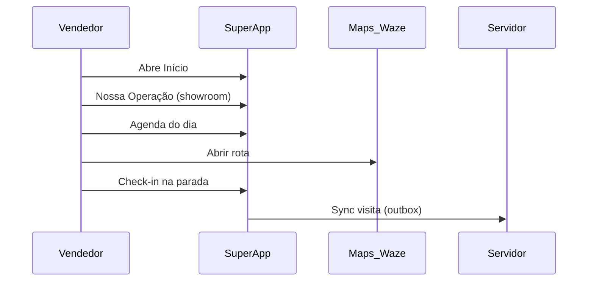

# Arquitetura de informação e wireframes (texto)

## App mobile — vendedor

### Navegação principal (tabs)

```
┌─────────────────────────────────────────────────────────┐
│  Início  │  Agenda  │  Pipeline  │  Missões  │  Operação │
└─────────────────────────────────────────────────────────┘
```

- **Mais / Perfil:** acessível a partir de Início (ícone) ou tab adicional conforme densidade de UX.

### Fluxo crítico (alta conversão)



### Wireframe — Início

```
┌──────────────────────────────┐
│  Olá, [Nome]      [avatar]   │
│  ─────────────────────────── │
│  Próxima visita  14:00       │
│  ┌────────────────────────┐  │
│  │ ACME Ind. — Campinas   │  │
│  │ João Silva · Compras   │  │
│  │ [Rota] [Ligar]         │  │
│  └────────────────────────┘  │
│  Missões da semana ████░░ 62% │
│  [ Ver showroom ]            │
└──────────────────────────────┘
```

### Wireframe — Agenda (dia)

```
┌──────────────────────────────┐
│  Hoje 9 mai    [Mapa|Lista]  │
│  ┌────────────────────────┐  │
│  │ 09:00  Parada 1        │  │
│  │ Endereço…              │  │
│  │ Contato · cargo · 📞   │  │
│  │ [Maps] [Waze] [Check-in]│  │
│  └────────────────────────┘  │
│  ┌────────────────────────┐  │
│  │ 14:00  Parada 2        │  │
│  └────────────────────────┘  │
└──────────────────────────────┘
```

### Wireframe — Nossa Operação

```
┌──────────────────────────────┐
│  [←] Nossa Operação          │
│  ┌────────────────────────┐  │
│  │      VIDEO PLAYER      │  │
│  │      (16:9)            │  │
│  └────────────────────────┘  │
│  [Pesagem] [Frota] [Certif.] │
│  Modo apresentação [toggle]  │
└──────────────────────────────┘
```

## Web admin — gestão e executivo

### Wireframe — Dashboard

```
┌──────────────────────────────────────────────────────────┐
│ RG Ambiental · Admin          [filtro período] [usuário]│
├─────────────┬────────────────────────────────────────────┤
│ Mapa ao vivo│ KPIs: Visitas OK │ Check-in válido │ …    │
│  (markers)  ├────────────────────────────────────────────┤
│             │ Lista equipe: Em visita | Em rota | Offline│
│             ├────────────────────────────────────────────┤
│             │ Visitas recentes (timeline check-in/out)   │
└─────────────┴──────────────────────────────────────────┘
```

Implementação no protótipo: o app mobile cobre fluxo vendedor; o admin pode ser evoluído em fase 2 com React + mapa (mesmo contrato de API).
